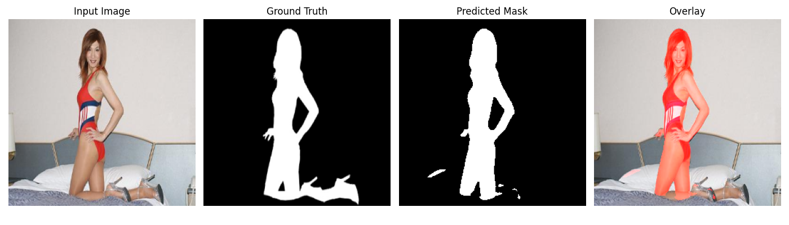

# Salient Object Detection using Deep Learning

## Project Overview

This project implements a deep learning-based Salient Object Detection (SOD) system using PyTorch.  
The goal is to automatically detect and segment the most visually important object in an image.

The project includes:
- Dataset preprocessing
- CNN-based segmentation
- Improved U-Net architecture
- GPU training using CUDA
- Evaluation metrics and visualization
- Prediction heatmaps and overlays

---

# Dataset

This project uses the DUTS Saliency Detection Dataset.

Dataset features:
- RGB images
- Binary saliency masks
- 10,553 image-mask pairs

Dataset preprocessing:
- Resize to 256x256
- Pixel normalization
- Train/validation split

The dataset is NOT uploaded to GitHub because of file size limitations.

Expected local structure:

```bash
dataset/
│
├── DUTS-TR/
│   ├── DUTS-TR-Image/
│   └── DUTS-TR-Mask/
```

---

# Model Architecture

## Baseline Model
- Encoder-decoder CNN
- Convolutional layers
- MaxPooling
- Upsampling decoder

## Improved Model
- U-Net architecture
- Pretrained ResNet34 encoder
- Skip connections
- BCE + Dice Loss

---

# Training Configuration

| Parameter | Value |
|---|---|
| Framework | PyTorch |
| Image Size | 256x256 |
| Batch Size | 8 |
| Epochs | 50 |
| Optimizer | Adam |
| GPU | NVIDIA RTX 4070 Laptop GPU |

---

# Final Evaluation Results

| Metric | Score |
|---|---|
| Mean IoU | 0.9186 |
| Mean Precision | 0.9634 |
| Mean Recall | 0.9515 |
| Mean F1 Score | 0.9535 |

Inference Time:
- ~0.13 sec per image

---

# Sample Prediction Results

## Heatmap Visualization



---

# Project Structure

```bash
SOD_Project/
│
├── dataset/
├── models/
├── results/
│   └── predictions_unet/
├── src/
│   ├── data_loader.py
│   ├── model.py
│   ├── train.py
│   ├── evaluate.py
│   └── demo.py
│
├── README.md
├── report.md
└── .gitignore
```

---

# How to Run

## Train Model

```bash
python src/train.py
```

## Evaluate Model

```bash
python src/evaluate.py
```

## Run Demo

```bash
python src/demo.py
```

---

# Technologies Used

- Python
- PyTorch
- OpenCV
- NumPy
- Matplotlib
- CUDA GPU Acceleration

---

# Future Improvements

- Attention-based segmentation
- Transformer architectures
- Real-time optimization
- Larger datasets
- Better augmentations

---

# Author

Beqir Bytyqi

GitHub:
https://github.com/beqooo09/SOD_Project
